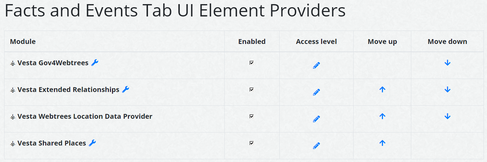

# ⚶ Vesta Facts and events (Webtrees Custom Module)

This [webtrees](https://www.webtrees.net/) custom module provides an extended 'Facts and Events' tab, with hooks for other custom modules.
The project’s website is [cissee.de](https://cissee.de).

## Contents

* [Features](#features)
* [Download](#download)
* [Installation](#installation)
* [License](#license)

### Features<a name="features"/>

Mainly intended as a base for other custom modules. Some features are available independently:

* Support for the non-standard Gedcom tag _FSFTID (FamilySearch id, e.g. 'M673-FP8'), in the tab and in the sidebar.

* Links to external maps (Google, Bing, OpenStreetMap) are configurable via module administration.

* Additional map services:
  * [Arcanum Maps](https://maps.arcanum.com/), providing a historical map of Europe in the XIX. century, and of the United States of America (1880-1926).
  * The option to configure an additional custom map provider via the control panel.

* The respective location data is obtained directly from GEDCOM, and may also be provided by other custom modules.

* If you have collected non-GEDCOM location data via webtrees itself, activate the 'Vesta Webtrees Location Data Provider' custom module to make this data available.

* Facts and events where a given individual is listed as an associate are also configurable. They are available via a separate checkbox. For these facts and events, the inverse associations and relationships are also displayed:

### Download<a name="download"/>

* Current version: 2.2.1.2.0
* Based on and tested with webtrees 2.2.1. Requires webtrees 2.2.1 or later.
* Requires the ⚶ Vesta Common module ('vesta_common').
* Download the zip file, which includes all Vesta modules, [here](https://cissee.de/vesta.latest.zip).
* Support, suggestions, feature requests: <ric@richard-cissee.de>
* Issues also via <https://github.com/vesta-webtrees-2-custom-modules/vesta_personal_facts/issues>

### Installation<a name="installation"/>

* Unzip the files and copy the contents of the modules_v4 folder to the respective folder of your webtrees installation. All related modules are included in the zip file. It's safe to overwrite the respective directories if they already exist (they are bundled with other custom modules as well), as long as other custom models using these dependencies are also upgraded to their respective latest versions.
* Enable the extended 'Facts and Events' module via Control Panel -> Modules -> All modules -> ⚶ Vesta Facts and Events.
* Configure the visibility of the old and the extended 'Facts and Events' tab via Control Panel -> Modules -> Tabs (usually, you'll want to use only one of them. You may just disable the original 'Facts and Events' module altogether).
* Similarly configure the visibility of the old and the extended 'Extra information' sidebar via Control Panel -> Modules -> Sidebars.
* Translations may be contributed via weblate: <https://hosted.weblate.org/projects/vesta-webtrees-custom-modules/>

### License<a name="license"/>

* **vesta_personal_facts: a webtrees custom module**
* Copyright (C) 2019 – 2025 Richard Cissée
* Derived from **webtrees** - Copyright 2022 webtrees development team.
* French translations provided by Ghezibde.
* Dutch translations provided by TheDutchJewel.
* Slovak translations provided by Ladislav Rosival.
* Czech translations provided by Josef Prause.
* Further translations contributed via weblate.

This program is free software: you can redistribute it and/or modify
it under the terms of the GNU General Public License as published by
the Free Software Foundation, either version 3 of the License, or
(at your option) any later version.

This program is distributed in the hope that it will be useful,
but WITHOUT ANY WARRANTY; without even the implied warranty of
MERCHANTABILITY or FITNESS FOR A PARTICULAR PURPOSE. See the
GNU General Public License for more details.

You should have received a copy of the GNU General Public License
along with this program. If not, see <http://www.gnu.org/licenses/>.
